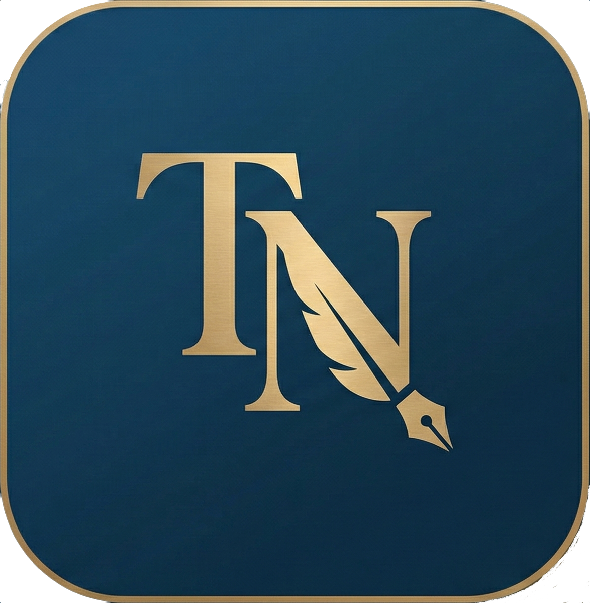

<p align="center">
  
</p>

<h1 align="center">The Novelist</h1>

<p align="center">
  Desktop app for planning, writing, revising, and exporting novels with local project storage, visual narrative canvases, and optional AI assistance.
</p>

<p align="center">
  <strong>Versione sorgente / Source version:</strong> 5.5.0<br />
  <strong>Piattaforme / Platforms:</strong> macOS, Windows<br />
  <strong>Licenza / License:</strong> Apache 2.0<br />
  <strong>Sito / Website:</strong> <a href="https://gloutchov.github.io/theNovelist/">gloutchov.github.io/theNovelist</a>
</p>

---

## Italiano

The Novelist e un'app desktop Electron pensata per scrittori che vogliono progettare e scrivere romanzi o racconti complessi. Unisce editor rich text, canvas narrativi, schede personaggio/location, timeline, revisioni, memoria locale del progetto, export e assistenza AI opzionale.

L'app nasce come progetto personale realizzato con assistenza AI. Il codice e open source, ispezionabile e modificabile, ma il progetto va considerato una alpha funzionante: utile, concreta, ma ancora migliorabile sul piano tecnico, UX e sicurezza.

### Download e distribuzione

Le build pubblicate sono disponibili nella sezione GitHub Releases del repository.

- Build supportate: macOS e Windows.
- Build non firmate: su macOS puo comparire Gatekeeper; su Windows puo comparire SmartScreen o un avviso di autore sconosciuto.
- Checksum: gli artefatti di release includono SHA-256 quando generati dal workflow o da `npm run release:checksums`.
- Installazione macOS: apri il `.dmg` e trascina l'app in `Applicazioni`. Se necessario, usa `tasto destro > Apri` al primo avvio.
- Installazione Windows: usa l'installer `The-Novelist-Setup-<version>-x64.exe` oppure la build portable `The-Novelist-Portable-<version>-x64.exe`.

Nota: la cartella locale `release/` puo contenere build precedenti o artefatti generati durante sviluppo e test. Per gli utenti finali fa fede la pagina GitHub Releases.

### Funzionalita principali

- Cruscotto progetto con metriche, obiettivi, snapshot, semafori memoria/AI/fallback, stato AI/autosave e controlli editoriali.
- Interfaccia bilingue italiano/inglese con rilevamento automatico della lingua di sistema, override manuale e tema chiaro/scuro/sistema.
- Canvas capitoli con nodi, connessioni e trame parallele colorate.
- Canvas dedicati per trame, scene, personaggi e location.
- Editor capitolo/scena con formattazione, ricerca/sostituzione, riferimenti a `@personaggi`, `@location` e `#scene`.
- Creazione rapida di schede da testo selezionato.
- Timeline cronologica separata dall'ordine di lettura, con viste distinte per capitoli e scene.
- Scaletta drag and drop per ordinare il manoscritto.
- Vista lettura per capitolo singolo o documento completo.
- Revisioni di capitoli, scene, personaggi e location.
- Memoria Wiki locale in Markdown, derivata dal database del progetto e interrogabile dall'app.
- Analisi AI per coerenza narrativa, eventi non risolti, stile, ritmo e nomi/convenzioni.
- Export e stampa: capitolo singolo in DOCX/stampa; manoscritto completo in DOCX, ePUB e stampa.

### AI e privacy

Le funzioni AI sono disattivate per default nei nuovi progetti. L'utente deve abilitarle esplicitamente dalle Impostazioni.

Provider supportati:

- OpenAI API per assistenza testuale e generazione immagini in-app.
- Ollama per modelli locali.

Consensi disponibili:

- invio testo a strumenti AI;
- chiamate API esterne;
- auto-riassunto delle descrizioni;
- invio memoria progetto a provider esterni.

La memoria locale viene inviata a provider esterni solo se il consenso dedicato e attivo. Ollama resta disponibile per chi vuole mantenere il testo sul proprio computer.

### Documentazione utente

- [ISTRUZIONI.md](./ISTRUZIONI.md): manuale completo in italiano.
- [INSTRUCTIONS.md](./INSTRUCTIONS.md): traduzione completa in inglese.
- [SECURITY_MODEL.md](./SECURITY_MODEL.md): note tecniche su sicurezza, limiti residui e hardening.
- [MAPS.md](./MAPS.md): mappa del repository.

### Sviluppo locale

Requisiti:

- Node.js 22+
- npm 10+

Installazione e avvio:

```bash
npm install
npm run dev
```

Comandi principali:

```bash
npm run typecheck
npm run test
npm run test:e2e
npm run test:e2e:electron
npm run build
```

Packaging:

```bash
npm run pack
npm run dist:mac
npm run dist:win
npm run release:checksums
```

Note sui moduli nativi:

- `better-sqlite3` viene rebuildato per Electron prima di sviluppo/packaging.
- Dopo test Electron o packaging, i moduli vengono riportati al target Node per test e tool locali.

### Release 5.5.0

La versione 5.5.0 introduce:

- palette semaforo per lo stato di consegna nel Cruscotto;
- indicatore verde quando la stesura e in linea con la data prevista;
- indicatore rosso leggibile nei temi chiaro e scuro quando la stima supera la data prevista;
- box operativo nel Cruscotto con stato memoria, AI e fallback AI;
- canvas con apertura editor/schede su doppio click, multi-selezione `CTRL` e selezione rettangolare;
- diff locale nella vista Revisioni;
- undo/redo e modifica titolo negli editor Capitoli e Scene;
- Timeline separata in viste Capitoli e Scene.

Le note sintetiche della release corrente sono mantenute qui nel README per evitare duplicazione con un file separato.

---

## English

The Novelist is an Electron desktop app for writers who want to plan and write complex novels or short stories. It combines a rich text editor, visual narrative canvases, character/location cards, timeline, revisions, local project memory, exports, and optional AI assistance.

The app started as a personal project built with AI assistance. The code is open source, inspectable, and modifiable, but the project should still be treated as a working alpha: useful and concrete, yet still open to technical, UX, and security improvements.

### Download and Distribution

Published builds are available from the repository's GitHub Releases page.

- Supported builds: macOS and Windows.
- Unsigned builds: macOS Gatekeeper or Windows SmartScreen may show first-run warnings.
- Checksums: release artifacts include SHA-256 checksums when generated by the workflow or by `npm run release:checksums`.
- macOS install: open the `.dmg` and drag the app to `Applications`. If needed, use `Right click > Open` on first launch.
- Windows install: use `The-Novelist-Setup-<version>-x64.exe` or the portable build `The-Novelist-Portable-<version>-x64.exe`.

Note: the local `release/` folder may contain older builds or artifacts produced during development and testing. End users should rely on GitHub Releases.

### Main Features

- Project dashboard with metrics, goals, snapshots, memory/AI/fallback traffic lights, AI/autosave status, and editorial checks.
- Bilingual Italian/English interface with automatic system-language detection, manual override, and light/dark/system theme selection.
- Chapter canvas with nodes, connections, and color-coded parallel plots.
- Dedicated canvases for plots, scenes, characters, and locations.
- Chapter/scene editor with formatting, search/replace, references to `@characters`, `@locations`, and `#scenes`.
- Quick card creation from selected text.
- Chronological timeline independent from reading order, with separate chapter and scene views.
- Drag-and-drop outline for manuscript ordering.
- Reading view for a single chapter or the full document.
- Revisions for chapters, scenes, characters, and locations.
- Local Markdown Wiki memory derived from the project database and searchable from the app.
- AI analysis for narrative coherence, unresolved events, style, rhythm, and names/conventions.
- Export and print: single chapter to DOCX/print; full manuscript to DOCX, ePUB, and print.

### AI and Privacy

AI features are disabled by default in new projects. The user must explicitly enable them in Settings.

Supported providers:

- OpenAI API for text assistance and in-app image generation.
- Ollama for local models.

Available consents:

- sending text to AI tools;
- external API calls;
- automatic description summaries;
- sending project memory to external providers.

Local memory is sent to external providers only when the dedicated consent is enabled. Ollama remains available for users who want to keep text on their own computer.

### User Documentation

- [ISTRUZIONI.md](./ISTRUZIONI.md): complete Italian manual.
- [INSTRUCTIONS.md](./INSTRUCTIONS.md): complete English translation.
- [SECURITY_MODEL.md](./SECURITY_MODEL.md): technical security notes, residual risks, and hardening.
- [MAPS.md](./MAPS.md): repository map.

### Local Development

Requirements:

- Node.js 22+
- npm 10+

Install and run:

```bash
npm install
npm run dev
```

Main commands:

```bash
npm run typecheck
npm run test
npm run test:e2e
npm run test:e2e:electron
npm run build
```

Packaging:

```bash
npm run pack
npm run dist:mac
npm run dist:win
npm run release:checksums
```

Native module notes:

- `better-sqlite3` is rebuilt for Electron before development/packaging.
- After Electron tests or packaging, modules are restored to the Node target for local tests and tools.

### Release 5.5.0

Version 5.5.0 introduces:

- a traffic-light palette for the Dashboard delivery status;
- a green indicator when the draft is on track for the planned date;
- a readable red indicator in light and dark themes when the estimate exceeds the planned date;
- a Dashboard operations box with memory, AI, and AI fallback status;
- canvases that open editors/cards on double click, plus `CTRL` multi-select and rectangle selection;
- local diff in the Revisions view;
- undo/redo and title editing in the Chapter and Scene editors;
- Timeline split into Chapter and Scene views.

Short notes for the current release are kept here in the README to avoid duplicating them in a separate file.

## License

The Novelist is distributed under the Apache 2.0 license. See [LICENSE](./LICENSE).
